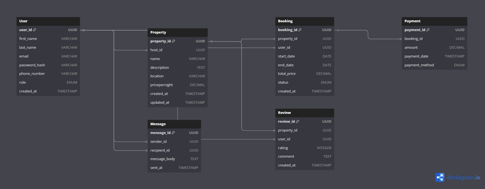

# Entity-Relationship Diagram (ERD)

This ERD describes the database structure for the Airbnb clone project.

## Entities and Relationships

- Description of all entities, attributes, and relationships

🧱 Entities and Attributes
1. User
user_id (PK, UUID, Indexed)

first_name (VARCHAR, NOT NULL)

last_name (VARCHAR, NOT NULL)

email (VARCHAR, UNIQUE, NOT NULL)

password_hash (VARCHAR, NOT NULL)

phone_number (VARCHAR, NULL)

role (ENUM: 'guest', 'host', 'admin', NOT NULL)

created_at (TIMESTAMP, DEFAULT CURRENT_TIMESTAMP)

2. Property
property_id (PK, UUID, Indexed)

host_id (FK → User.user_id)

name (VARCHAR, NOT NULL)

description (TEXT, NOT NULL)

location (VARCHAR, NOT NULL)

price_per_night (DECIMAL, NOT NULL)

created_at (TIMESTAMP, DEFAULT CURRENT_TIMESTAMP)

updated_at (TIMESTAMP, ON UPDATE CURRENT_TIMESTAMP)

3. Booking
booking_id (PK, UUID, Indexed)

property_id (FK → Property.property_id)

user_id (FK → User.user_id)

start_date (DATE, NOT NULL)

end_date (DATE, NOT NULL)

total_price (DECIMAL, NOT NULL)

status (ENUM: 'pending', 'confirmed', 'canceled', NOT NULL)

created_at (TIMESTAMP, DEFAULT CURRENT_TIMESTAMP)

4. Payment
payment_id (PK, UUID, Indexed)

booking_id (FK → Booking.booking_id)

amount (DECIMAL, NOT NULL)

payment_date (TIMESTAMP, DEFAULT CURRENT_TIMESTAMP)

payment_method (ENUM: 'credit_card', 'paypal', 'stripe', NOT NULL)

5. Review
review_id (PK, UUID, Indexed)

property_id (FK → Property.property_id)

user_id (FK → User.user_id)

rating (INTEGER, CHECK: 1 ≤ rating ≤ 5, NOT NULL)

comment (TEXT, NOT NULL)

created_at (TIMESTAMP, DEFAULT CURRENT_TIMESTAMP)

6. Message
message_id (PK, UUID, Indexed)

sender_id (FK → User.user_id)

recipient_id (FK → User.user_id)

message_body (TEXT, NOT NULL)

sent_at (TIMESTAMP, DEFAULT CURRENT_TIMESTAMP)

🔗 Relationships
User ↔ Booking

One user can make many bookings (1:N)

FK: Booking.user_id → User.user_id

User ↔ Property

One host (user) can own multiple properties (1:N)

FK: Property.host_id → User.user_id

Property ↔ Booking

One property can have many bookings (1:N)

FK: Booking.property_id → Property.property_id

Booking ↔ Payment

One booking can have one payment (1:1)

FK: Payment.booking_id → Booking.booking_id

User ↔ Review

One user can write many reviews (1:N)

FK: Review.user_id → User.user_id

Property ↔ Review

One property can have many reviews (1:N)

FK: Review.property_id → Property.property_id

User ↔ Message

A user can send and receive messages (N:M self-relationship)

FK: Message.sender_id, Message.recipient_id → User.user_id

🛠 Constraints Summary
UNIQUE: User.email

ENUM Constraints:

User.role: 'guest', 'host', 'admin'

Booking.status: 'pending', 'confirmed', 'canceled'

Payment.payment_method: 'credit_card', 'paypal', 'stripe'

CHECK Constraint:

Review.rating: BETWEEN 1 AND 5

NOT NULL: All required fields